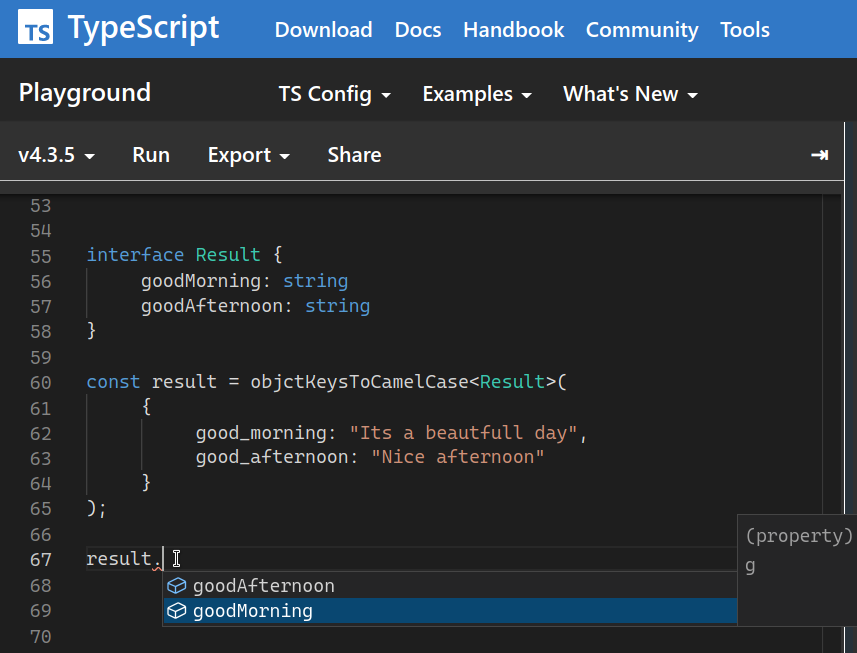

# Snake Case to Camel Case

A module to convert object keys to camelcase or snakecase.

`npm i keys-converter` or `yarn add keys-converter`


---

### How to use it?

`objectKeysToCamelCaseV2` and `objectKeysToSnakelCaseV2`

### Two available functions

- convert object keys from `snake_case` to `camelCase`
- convert object keys from `camelCase` to `snake_case`


The function `objectKeysToCamelCaseV2` receives an object.
You can to infer the return type as argument so the result returned will have types

#### Inference `result` and `input`


If you provide the input type the function will validate the arguments,
So if you provide the result type the returned value will have "types"



---

## Warning

> - Function does not remove the first underscore for security

example
If your object has a protected prop like `_id` It will keep it


```
