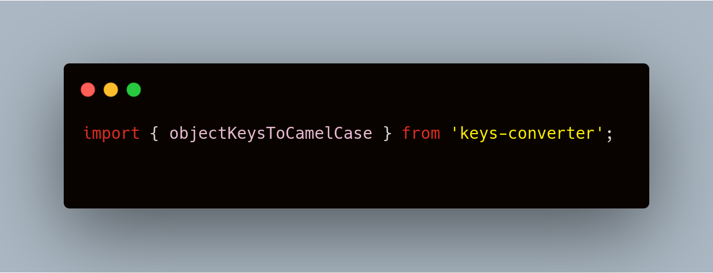
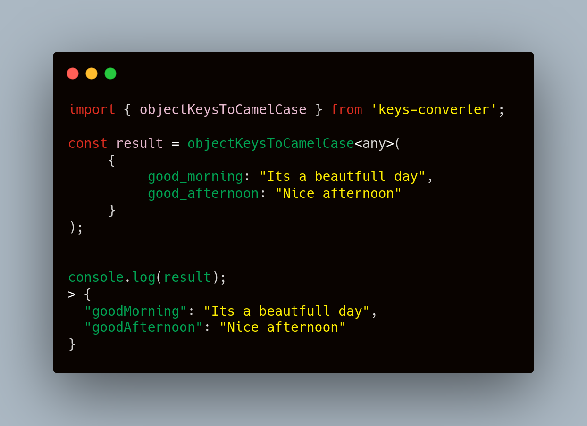
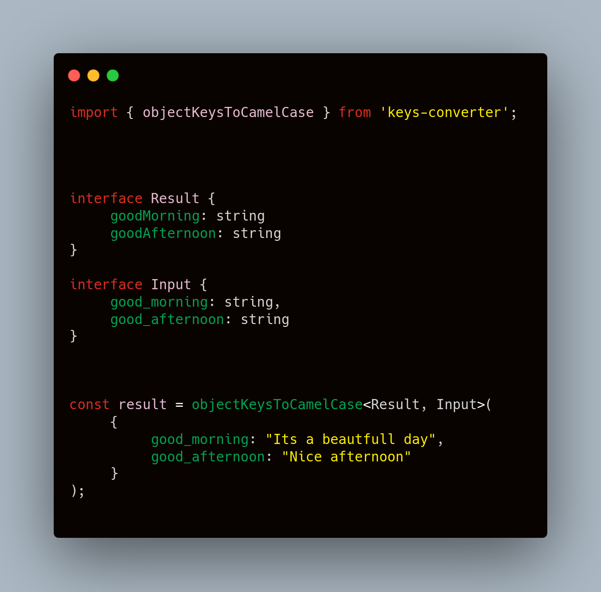
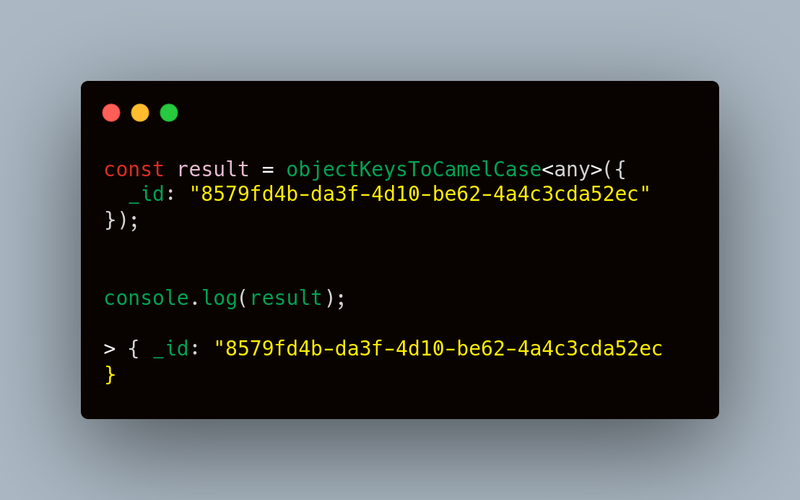

# Snake Case to Camel Case

A module to convert object keys to camelcase.

`npm i keys-converter` or `yarn add keys-converter`



---

### How to use it?

```ts
import { objectKeysToCamelCase } from "keys-converter";
```

The function `objectKeysToCamelCase` receives an object.
You can to infer the return type as argument so the result returned will have types



### Inference `result` and `input`



If you provide the input type the function will validate the arguments,
So if you provide the result type the returned value will have "types"


---

## Warning

> - Function does not remove the first underscore for security

example
If your object has a protected prop like `_id` It will keep it


