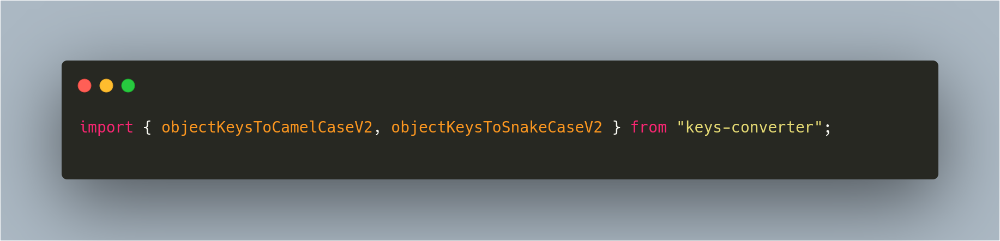
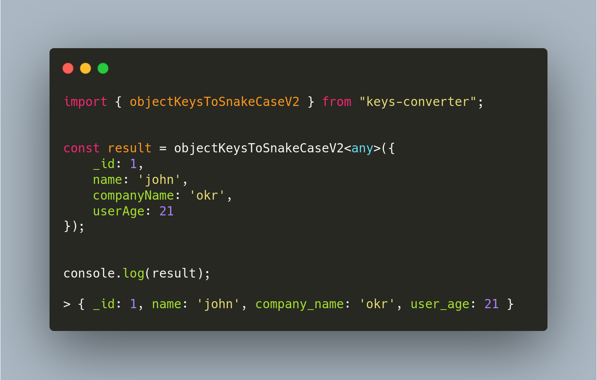
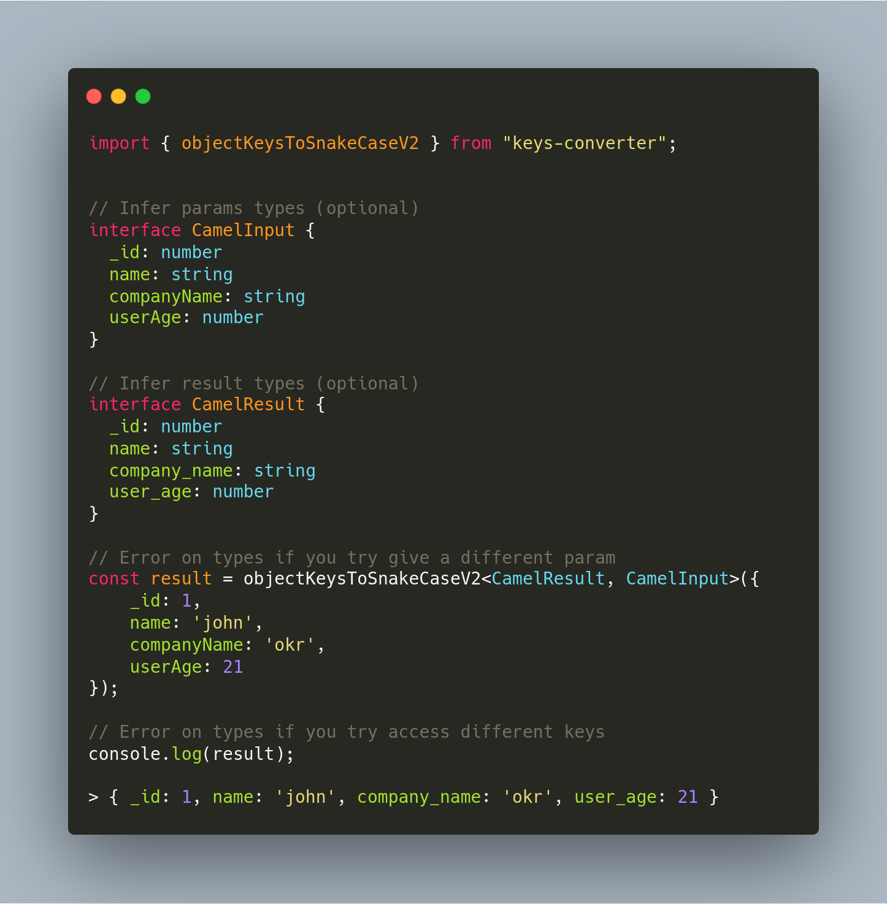
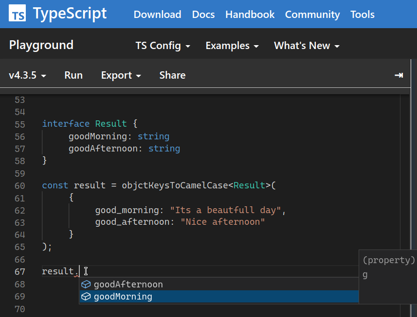
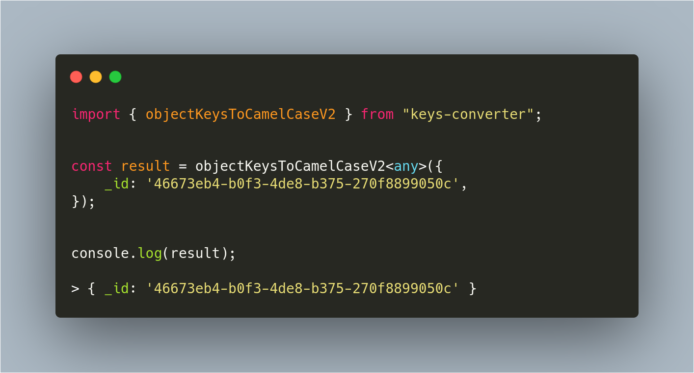

# Snake Case to Camel Case

A module to convert object keys to camelcase.

`npm i keys-converter` or `yarn add keys-converter`



---

### How to use it?

`objectKeysToCamelCaseV2` and `objectKeysToSnakelCaseV2`

### Two available functions

convert object keys from `snake_case` to `camelCase`


convert object keys from `camelCase` to `snake_case`



The function `objectKeysToCamelCaseV2` receives an object
You can infer the return as argument so the result will be typed



### Inference `result` and `input`

If you provide the input type, the function validate the arguments
So if you provide result type the return will be typed



---

## Warning

> - The function does not remove first underscore for security

example
If your object has an protected prop like `_id` It will keep it


```
